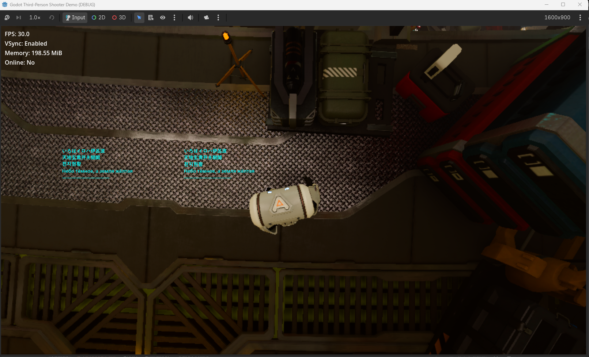

# FAQ

[English](#english) | [中文](#中文)

---

## English

### What is this project?

GDMYDebug is a small personal project for learning, experimentation, and debugging with Godot Engine. It is not intended to be a production-ready or community-driven project.

Because of its personal and experimental nature, Issues and Pull Requests are currently disabled, and there are no guarantees regarding maintenance or backward compatibility.

Discussions are enabled for questions, ideas, feedback, or general discussion about the project.

### Does GDMYDebug support GDExtension?

No.

GDMYDebug is currently implemented as a native Godot Engine Module and requires building Godot from source.

### Any plan to support GDExtension?

No.

I actually tried GDExtension at first, but I found that it required too many workarounds compared to a C++ Module.

### Would you prefer this to be implemented officially in Godot?

Yes.

This project is mainly an experiment to explore what a simple in-game debug utility could look like when implemented directly in the engine.

If Godot eventually provides a similar feature officially, I would actually prefer using the official implementation rather than maintaining my own module.

### Does GDMYDebug work in Release builds?

GDMYDebug is designed to be disabled in non-Debug/Development builds.

Only the implementation is disabled. The GDScript API can still be recognized.

This behavior has NOT been fully tested yet.

### Why doesn't `GDMYDebug` appear in my project?

Make sure that:

* GDMYDebug is placed under the `modules` directory.
* Godot was rebuilt after adding the module.
* The project is using the newly built Godot executable.

### Does `print()` write to the Godot Output panel?

No.

`GDMYDebug.print()` displays text directly on the game screen.

### What is the difference between `pos` and `abs_pos`?

`pos` uses GDMYDebug's base-resolution coordinate system. The position is scaled according to the current viewport size.

`abs_pos` uses the actual viewport coordinates and is not scaled based on the base resolution.

For example, if the base resolution is `1920x1080`:

```text
set_print_pos(20, 20)

1920x1080  → (20, 20)
1280x720   → (13.3, 13.3)
2560x1440  → (26.7, 26.7)
```

On the other hand:

```text
set_print_abs_pos(20, 20)

1920x1080  → (20, 20)
1280x720   → (20, 20)
2560x1440  → (20, 20)
```

`pos` uses GDMYDebug's own scaling rule rather than directly following all of Godot's viewport, window, and content-scaling settings. Because Godot provides many different ways to configure scaling, `pos` may not always behave exactly like other Godot Nodes or UI elements.

If you need an exact position in the current viewport, use `abs_pos`.

### Why is the debug text displayed on top of the game?

GDMYDebug uses a dedicated canvas with a high layer value (`RenderingServerEnums::CANVAS_LAYER_MAX`), so its debug output is intended to appear above normal scene rendering.

### Why is it called GDMYDebug?

I felt that `GDDebug` or `GodotDebug` could potentially conflict with another module in the future, so I added `MY` to the name beforehand to avoid potential naming conflicts.

### Why can't I see the text on the screen?

There are two possible reasons:

* The `print` function is not called every frame. The displayed text is cleared every frame, so add the print code to a function that is called every frame.
* The text position is outside the screen.

### Why are some characters missing?

GDMYDebug uses Godot's fallback font.

```cpp
if (auto *theme_db = ThemeDB::get_singleton()) {
    if (const Ref<Font> font = theme_db->get_fallback_font();
            font.is_valid()) {
    }
}
```

A possible reason is that the fallback font does not support that character.

According to my tests, however, most common characters are supported.



### How can I change the font used by GDMYDebug?

I haven't tested the methods below yet.

* `ThemeDB::set_fallback_font()` is exposed to GDScript, so you may be able to change the fallback font using it.

```cpp
ClassDB::bind_method(D_METHOD("set_fallback_font", "font"), &ThemeDB::set_fallback_font);
```

* [Godot Forum | Changing fallback font in default system font resource](https://forum.godotengine.org/t/changing-fallback-font-in-default-system-font-resource/58809)
* If you can find the font resource file, you may be able to replace it.

### Are there any potential problems?

There are some.

* The architecture relies heavily on having somewhere in the engine that can execute my implementation every frame. In the end, the only place I found was the `RenderingServer`'s `frame_pre_draw` signal, which is probably not the most appropriate solution.
* There is currently no limit on how many times `print()` can be called per frame. If you call it an enormous number of times in a single frame, you may hit some engine-side limits, causing crashes, memory exhaustion, performance drops, etc. On the other hand, I don't think this should normally happen, because you would probably stop being able to find what you actually want to see long before hitting any engine-side limits.

But anyway, it currently works fine.

### Any future plans?

Probably not. This project is mainly an experiment, and I don't have any specific plans to turn it into a larger or more fully featured tool.

If you need something different, feel free to modify the source yourself.

---

## 中文

### 这是一个什么项目？

GDMYDebug 是一个用于学习、实验以及 Godot Engine 调试的小型个人项目。

它并不是为了成为一个生产环境工具，也不是作为一个社区驱动的项目来开发的。

由于项目本身具有个人实验性质，目前关闭了 Issues 和 Pull Requests，并不保证持续维护或向后兼容。

Discussions 则用于提问、提出想法、反馈意见以及讨论项目本身。

### GDMYDebug 支持 GDExtension 吗？

不支持。

GDMYDebug 目前是直接编译进 Godot 的原生 Module，需要从源码编译 Godot。

### 以后有计划支持 GDExtension 吗？

没有。

我一开始其实尝试过 GDExtension，但相比 C++ Module，我觉得需要做的 workaround 太多了。

### 你更希望这个功能由 Godot 官方实现吗？

是的。

这个项目主要是为了尝试探索：如果直接在 Godot Engine 内部实现一个简单的游戏内调试工具，它可以是什么样子。

如果以后 Godot 官方提供了类似的功能，我实际上更希望使用官方实现，而不是继续维护自己的 Module。

### GDMYDebug 在 Release 构建中会工作吗？

GDMYDebug 的设计是在非 Debug/Development 构建中禁用。

只有具体实现会被禁用，GDScript API 仍然可以被识别。

不过这个行为目前还没有经过完整测试。

### 为什么项目里找不到 `GDMYDebug`？

请确认：

* GDMYDebug 位于 `modules` 目录下。
* 添加 Module 后重新编译了 Godot。
* 项目使用的是刚刚编译出的 Godot 可执行文件。

### `print()` 会输出到 Godot 的 Output 面板吗？

不会。

`GDMYDebug.print()` 会直接将文字显示在游戏画面上。

### `pos` 和 `abs_pos` 有什么区别？

`pos` 使用 GDMYDebug 自己定义的基准分辨率坐标系统，并会根据当前 Viewport 大小对坐标进行缩放。

`abs_pos` 使用实际的 Viewport 坐标，不会根据基准分辨率进行缩放。

例如，假设基准分辨率为 `1920x1080`：

```text
set_print_pos(20, 20)

1920x1080  → (20, 20)
1280x720   → (13.3, 13.3)
2560x1440  → (26.7, 26.7)
```

而：

```text
set_print_abs_pos(20, 20)

1920x1080  → (20, 20)
1280x720   → (20, 20)
2560x1440  → (20, 20)
```

`pos` 使用的是 GDMYDebug 自己的缩放规则，而不是直接跟随 Godot 的所有 Viewport、Window 和 Content Scaling 设置。

由于 Godot 提供了很多不同的缩放配置方式，`pos` 的行为不一定始终与其他 Godot Node 或 UI 元素保持一致。

如果需要指定当前 Viewport 中的实际位置，请使用 `abs_pos`。

### 为什么调试文字会显示在游戏场景上方？

GDMYDebug 使用了一个较高 Layer 值的独立 Canvas（`RenderingServerEnums::CANVAS_LAYER_MAX`），因此调试文字设计为显示在普通场景渲染之上。

### 为什么叫 GDMYDebug？

我觉得 `GDDebug` 或 `GodotDebug` 以后可能会和其他 Module 发生命名冲突，所以提前加上 `MY`，避免潜在的命名冲突。

### 为什么看不到屏幕上的文字？

有两个可能的原因：

* `print` 没有每帧调用。因为每一帧都会清除之前显示的文字，所以需要将 print 代码放在每帧都会执行的函数中。
* 设置的文字位置在屏幕范围之外。

### 为什么有些字符无法显示？

GDMYDebug 使用的是 Godot 的 fallback font。

```cpp
if (auto *theme_db = ThemeDB::get_singleton()) {
    if (const Ref<Font> font = theme_db->get_fallback_font();
            font.is_valid()) {
    }
}
```

一种可能的原因是 fallback font 不支持该字符。

不过根据我的测试，大多数常见字符都可以正常显示。


### 如何修改 GDMYDebug 使用的字体？

下面的方法我还没有实际测试。

* `ThemeDB::set_fallback_font()` 已经暴露给 GDScript，因此可以尝试通过它修改 fallback font。

```cpp
ClassDB::bind_method(D_METHOD("set_fallback_font", "font"), &ThemeDB::set_fallback_font);
```

* [Godot Forum | Changing fallback font in default system font resource](https://forum.godotengine.org/t/changing-fallback-font-in-default-system-font-resource/58809)
* 如果能找到对应的字体资源文件，也可以尝试直接替换它。

### 有没有什么潜在的问题？

有一些。

* 目前的架构比较依赖引擎中某个地方能够每帧执行我的实现。最后我找到的方式是使用 `RenderingServer` 的 `frame_pre_draw` 信号，但这可能并不是最合适的方案。
* 目前没有限制每帧可以调用多少次 `print()`。如果一帧内调用了非常多次，可能会触及引擎侧的一些限制，从而导致崩溃、内存不足、性能下降等问题。但正常情况下，真正触及引擎限制之前，输出量已经大到让你根本找不到自己想看的内容了。

不过总之，目前它运行得还不错。

### 以后有什么计划？

大概没有。

这个项目主要就是一个实验，我目前没有把它发展成大型或功能完善工具的具体计划。

如果你有不同的需求，也可以直接修改源码。
