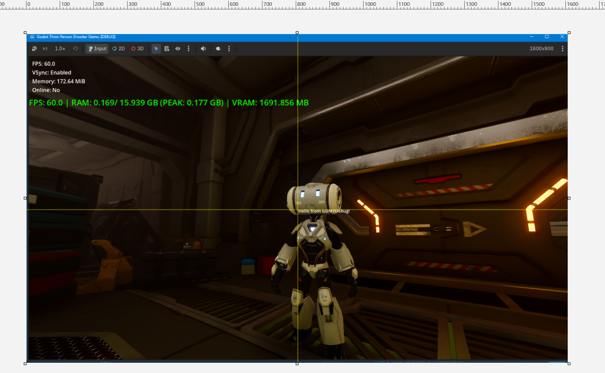
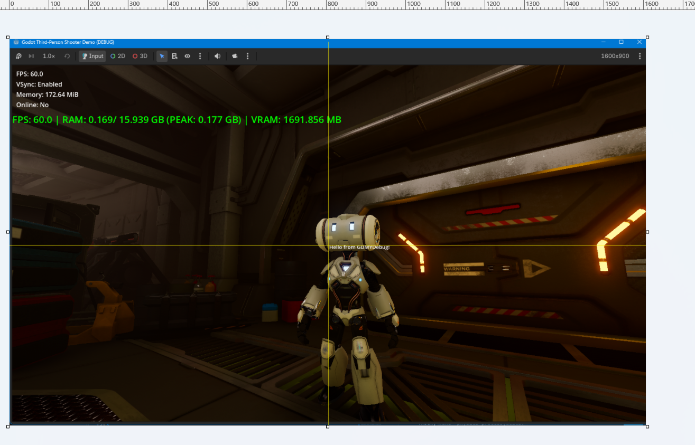

# Getting Started

## English

This tutorial uses Godot's official TPS Demo to demonstrate how to get started with GDMYDebug.

[Godot | Asset Library | Assets | Third Person Shooter (TPS) Demo](https://godotengine.org/asset-library/asset/678)

By the end of this tutorial, you will be able to display debug text directly in the game viewport and enable the performance statistics overlay.

---

### 1. Prepare the Environment

You will need:

* Godot source code
* A working Godot build environment
* GDMYDebug
* Godot's official TPS Demo

Make sure that you can build and run your own Godot source build before adding GDMYDebug.

---

### 2. Add GDMYDebug

Add GDMYDebug to the `modules` directory of the Godot source tree:

```text
godot/
└── modules/
    └── GDMYDebug/
```

Then rebuild Godot.

After the build finishes, launch the newly built Godot Editor.

---

### 3. Open the TPS Demo

Download and open Godot's official TPS Demo.

Use a version of the TPS Demo that matches your Godot source version.

Run the original TPS Demo first and make sure that it works correctly.

Once the original demo is working, you can start using GDMYDebug.

---

### 4. Your First Debug Print

Modify `func _physics_process(delta: float) -> void:` in `res://player/player.gd` as follows:

```gdscript
# res://player/player.gd

func _physics_process(delta: float) -> void:

    GDMYDebug.set_print_abs_pos_xy(0, 0)
    GDMYDebug.print("Hello from GDMYDebug!")

    if multiplayer.is_server():
        apply_input(delta)
    else:
        animate(current_animation, delta)
```

Run the game.

If everything is working correctly, you should see:

```text
Hello from GDMYDebug!
```

directly inside the game viewport at the top-left corner after clicking **"PLAY"**.



---

### 5. Set the Debug Text Position

You can set the position of the debug text with:

```gdscript
GDMYDebug.set_print_abs_pos_xy(20, 20)
```

For example:

```gdscript
# res://player/player.gd

func _physics_process(delta: float) -> void:

    GDMYDebug.set_print_abs_pos_xy(20, 20)
    GDMYDebug.print("Hello from GDMYDebug!")

    if multiplayer.is_server():
        apply_input(delta)
    else:
        animate(current_animation, delta)
```

`abs_pos` uses absolute viewport coordinates. Therefore, the text may appear at different visual positions when the viewport resolution changes.

You can instead use `pos`, which uses a base coordinate system of **1920×1080**. This allows the text to remain at approximately the same visual position across different resolutions, when possible.

For example:

```gdscript
# res://player/player.gd

func _physics_process(delta: float) -> void:

    GDMYDebug.set_print_pos_xy(960, 540)
    GDMYDebug.print("Hello from GDMYDebug!")

    if multiplayer.is_server():
        apply_input(delta)
    else:
        animate(current_animation, delta)
```

For example, the text will still appear around the center when using a **1600×900** viewport.



---

### 6. Set the Debug Text Color

GDMYDebug provides several predefined colors:

```gdscript
GDMYDebug.set_print_color(GDMYDebug.red())
```

For example, modify `func _physics_process(delta: float) -> void:` in `res://enemies/red_robot/red_robot.gd` as follows:

```gdscript
# res://enemies/red_robot/red_robot.gd

func _physics_process(delta: float) -> void:

    var camera := get_viewport().get_camera_3d()

    if not camera.is_position_behind(global_transform.origin):

        GDMYDebug.set_print_color(GDMYDebug.green())

        var screen_pos := camera.unproject_position(global_transform.origin)

        GDMYDebug.set_print_abs_pos_xy(screen_pos.x, screen_pos.y)

        if state == State.APPROACH:
            GDMYDebug.set_print_color(GDMYDebug.cyan())
            GDMYDebug.print("APPROACH")

        elif state == State.AIM:
            GDMYDebug.set_print_color(GDMYDebug.yellow())
            GDMYDebug.print("AIM")

        elif state == State.SHOOTING:
            GDMYDebug.set_print_color(GDMYDebug.red())
            GDMYDebug.print("SHOOTING")

    if dead:
        return

    # other implementations ...
```

You should now see the enemy's current state displayed in different colors in the game.

---

### 7. Display Runtime Data from the TPS Demo

You can use GDMYDebug to inspect actual runtime data from the TPS Demo.

For example, display the red robot's position:

```gdscript
# res://enemies/red_robot/red_robot.gd

func _physics_process(delta: float) -> void:

    var camera := get_viewport().get_camera_3d()

    if not camera.is_position_behind(global_transform.origin):

        GDMYDebug.set_print_color(GDMYDebug.green())

        var screen_pos := camera.unproject_position(global_transform.origin)

        GDMYDebug.set_print_abs_pos_xy(screen_pos.x, screen_pos.y)

        var pos_string = "(%.1f, %.1f, %.1f)" % [
            global_transform.origin.x,
            global_transform.origin.y,
            global_transform.origin.z]

        GDMYDebug.print(pos_string)

        if state == State.APPROACH:
            GDMYDebug.set_print_color(GDMYDebug.cyan())
            GDMYDebug.print("APPROACH")

        elif state == State.AIM:
            GDMYDebug.set_print_color(GDMYDebug.yellow())
            GDMYDebug.print("AIM")

        elif state == State.SHOOTING:
            GDMYDebug.set_print_color(GDMYDebug.red())
            GDMYDebug.print("SHOOTING")

    if dead:
        return

    # other implementations ...
```

---

### 8. Enable Performance Statistics

GDMYDebug also provides a simple performance statistics overlay.

Enable it with:

```gdscript
GDMYDebug.set_perf_stats_enabled(true)
```

For example:

```gdscript
# res://player/player.gd

func _ready() -> void:

    GDMYDebug.set_perf_stats_enabled(true)
    GDMYDebug.set_perf_stats_font_color(GDMYDebug.green())
    GDMYDebug.set_perf_stats_font_size(24)
    GDMYDebug.set_perf_stats_print_abs_pos_xy(0, 120)

    # Pre-initialize orientation transform.
    orientation = player_model.global_transform
    orientation.origin = Vector3()

    if not multiplayer.is_server():
        set_process(false)
```

When you run the TPS Demo, performance information will be displayed directly in the game viewport.

---

### 9. Release Builds

> **Note:** Release Build support has not been fully tested yet.

The GDScript API of GDMYDebug can remain available in Release Builds.

This means that you can leave calls such as:

```gdscript
GDMYDebug.print("Debug information")
```

in your project during development.

Debug / Development Builds execute the actual debug implementation.

Release Builds keep the API but do not execute the debug implementation.

This means you do not need to remove GDMYDebug calls from your project when preparing a Release Build.

---

# 中文

本教程通过 Godot 官方 TPS Demo，演示如何开始使用 GDMYDebug。

[Godot | Asset Library | Assets | Third Person Shooter (TPS) Demo](https://godotengine.org/asset-library/asset/678)

完成本教程后，你将能够直接在游戏画面中显示 Debug 文本，并启用性能统计显示。

---

### 1. 准备环境

你需要：

* Godot 源码
* 可以正常编译 Godot 的开发环境
* GDMYDebug
* Godot 官方 TPS Demo

在添加 GDMYDebug 之前，请先确认你可以正常编译并运行自己的 Godot 源码版本。

---

### 2. 添加 GDMYDebug

将 GDMYDebug 添加到 Godot 源码的 `modules` 目录：

```text
godot/
└── modules/
    └── GDMYDebug/
```

然后重新编译 Godot。

编译完成后，启动重新编译得到的 Godot Editor。

---

### 3. 打开 TPS Demo

下载并打开 Godot 官方 TPS Demo。

请使用与你的 Godot 源码版本相匹配的 TPS Demo 版本。

首先运行原版 TPS Demo，确认项目能够正常运行。

确认原版 Demo 运行正常后，就可以开始使用 GDMYDebug。

---

### 4. 第一个 Debug Print

修改 `res://player/player.gd` 中的 `func _physics_process(delta: float) -> void:`：

```gdscript
# res://player/player.gd

func _physics_process(delta: float) -> void:

    GDMYDebug.set_print_abs_pos_xy(0, 0)
    GDMYDebug.print("Hello from GDMYDebug!")

    if multiplayer.is_server():
        apply_input(delta)
    else:
        animate(current_animation, delta)
```

运行游戏。

如果一切正常，点击 **"PLAY"** 后，你应该可以在游戏画面的左上角看到：

```text
Hello from GDMYDebug!
```


---

### 5. 设置 Debug 文本的位置

可以使用：

```gdscript
GDMYDebug.set_print_abs_pos_xy(20, 20)
```

设置 Debug 文本的位置。

例如：

```gdscript
# res://player/player.gd

func _physics_process(delta: float) -> void:

    GDMYDebug.set_print_abs_pos_xy(20, 20)
    GDMYDebug.print("Hello from GDMYDebug!")

    if multiplayer.is_server():
        apply_input(delta)
    else:
        animate(current_animation, delta)
```

`abs_pos` 使用的是 Viewport 的绝对坐标。因此，当 Viewport 分辨率发生变化时，文字在画面中的视觉位置也可能发生变化。

你也可以使用 `pos`。`pos` 使用 **1920×1080** 作为基础坐标系，因此在不同分辨率下，可以尽可能让文字保持相同的视觉位置。

例如：

```gdscript
# res://player/player.gd

func _physics_process(delta: float) -> void:

    GDMYDebug.set_print_pos_xy(960, 540)
    GDMYDebug.print("Hello from GDMYDebug!")

    if multiplayer.is_server():
        apply_input(delta)
    else:
        animate(current_animation, delta)
```

例如，在 **1600×900** 的 Viewport 下，文字仍然会显示在画面中央附近。


---

### 6. 设置 Debug 文本颜色

GDMYDebug 提供了多个预定义颜色：

```gdscript
GDMYDebug.set_print_color(GDMYDebug.red())
```

例如，修改 `res://enemies/red_robot/red_robot.gd` 中的 `func _physics_process(delta: float) -> void:`：

```gdscript
# res://enemies/red_robot/red_robot.gd

func _physics_process(delta: float) -> void:

    var camera := get_viewport().get_camera_3d()

    if not camera.is_position_behind(global_transform.origin):

        GDMYDebug.set_print_color(GDMYDebug.green())

        var screen_pos := camera.unproject_position(global_transform.origin)

        GDMYDebug.set_print_abs_pos_xy(screen_pos.x, screen_pos.y)

        if state == State.APPROACH:
            GDMYDebug.set_print_color(GDMYDebug.cyan())
            GDMYDebug.print("APPROACH")

        elif state == State.AIM:
            GDMYDebug.set_print_color(GDMYDebug.yellow())
            GDMYDebug.print("AIM")

        elif state == State.SHOOTING:
            GDMYDebug.set_print_color(GDMYDebug.red())
            GDMYDebug.print("SHOOTING")

    if dead:
        return

    # other implementations ...
```

运行游戏后，你应该可以看到敌人的当前状态，并且不同状态会使用不同的颜色显示。

---

### 7. 显示 TPS Demo 的运行时数据

你可以使用 GDMYDebug 查看 TPS Demo 中实际运行时的数据。

例如，显示红色机器人的位置：

```gdscript
# res://enemies/red_robot/red_robot.gd

func _physics_process(delta: float) -> void:

    var camera := get_viewport().get_camera_3d()

    if not camera.is_position_behind(global_transform.origin):

        GDMYDebug.set_print_color(GDMYDebug.green())

        var screen_pos := camera.unproject_position(global_transform.origin)

        GDMYDebug.set_print_abs_pos_xy(screen_pos.x, screen_pos.y)

        var pos_string = "(%.1f, %.1f, %.1f)" % [
            global_transform.origin.x,
            global_transform.origin.y,
            global_transform.origin.z]

        GDMYDebug.print(pos_string)

        if state == State.APPROACH:
            GDMYDebug.set_print_color(GDMYDebug.cyan())
            GDMYDebug.print("APPROACH")

        elif state == State.AIM:
            GDMYDebug.set_print_color(GDMYDebug.yellow())
            GDMYDebug.print("AIM")

        elif state == State.SHOOTING:
            GDMYDebug.set_print_color(GDMYDebug.red())
            GDMYDebug.print("SHOOTING")

    if dead:
        return

    # other implementations ...
```

---

### 8. 启用性能统计

GDMYDebug 还提供了一个简单的性能统计显示。

使用以下代码启用：

```gdscript
GDMYDebug.set_perf_stats_enabled(true)
```

例如：

```gdscript
# res://player/player.gd

func _ready() -> void:

    GDMYDebug.set_perf_stats_enabled(true)
    GDMYDebug.set_perf_stats_font_color(GDMYDebug.green())
    GDMYDebug.set_perf_stats_font_size(24)
    GDMYDebug.set_perf_stats_print_abs_pos_xy(0, 120)

    # Pre-initialize orientation transform.
    orientation = player_model.global_transform
    orientation.origin = Vector3()

    if not multiplayer.is_server():
        set_process(false)
```

运行 TPS Demo 后，性能信息会直接显示在游戏画面中。

---

### 9. Release Build

> **注意：** Release Build 目前还没有经过完整测试。

GDMYDebug 的 GDScript API 可以在 Release Build 中继续保留。

也就是说，在开发过程中可以保留：

```gdscript
GDMYDebug.print("Debug information")
```

这样的代码。

Debug / Development Build 会执行实际的 Debug 实现。

Release Build 会保留 API，但不会执行实际的 Debug 实现。

因此，在准备 Release Build 时，不需要从项目中删除 GDMYDebug 的调用。
